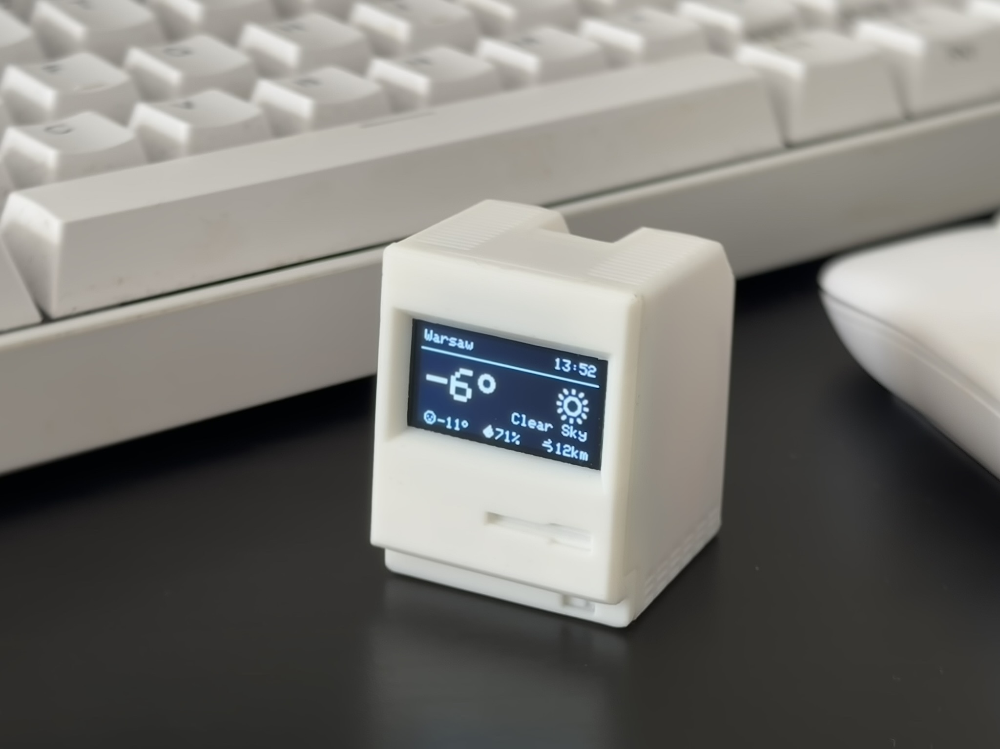

# 🖥️ Tinytosh



> **The open-source, retro-styled desktop companion.** > Part smart display, part hardware monitor, 100% hackable.


---

## 🚀 Get Started (The Easy Way)

**You do not need to compile code to use Tinytosh.** This repository hosts a **Web Installer** and a complete **Interactive Setup Guide**. You can flash your device directly from your browser in under 2 minutes.

[👉 **Launch Setup Guide & Web Flasher**](https://vladimirgitsarev.github.io/Tinytosh/)  
*(Click above to view the assembly guide, wiring diagrams, and configure your device)*

---

## 🧐 What is this?

**Tinytosh** is a DIY project that fits a smart dashboard inside a tiny, 3D-printed Macintosh-style case. It connects to your WiFi to display useful information or hooks up to your PC via USB to show real-time hardware stats.

### ✨ Key Features
* **Modular Dashboard:** Enable/Disable screens on the fly via a Web Panel.
* **Zero Config APIs:** Uses free public APIs for Crypto, Weather, and Air Quality. No API keys required.
* **PC Monitoring:** View CPU, RAM, Disk, and Network usage via the USB Bridge.
* **Visuals:** Smooth OLED animations (Slide, Dissolve, Curtain, Blinds) and 60fps refresh rates.
* **Privacy First:** No accounts, no cloud tracking. Everything runs locally on the ESP32.


---

## 🛠️ The Software Stack

For developers, makers, and the curious, here is how the magic happens. The project consists of two distinct software parts:

### 1. Firmware (ESP32-C3)
*Written in C++ using the Arduino Framework.*

The firmware is designed to be **non-blocking** and **modular**.
* **Web-Based Config:** The device hosts its own Web Server. The UI is built with HTML/CSS/JS stored in `PROGMEM` (gzipped) to save space.
* **Dynamic Rendering:** The `DisplayService` handles the OLED. It supports "partial screen buffering," allowing for complex transition effects (like dissolving pixels or sliding curtains) without needing a massive frame buffer.
* **Smart Wifi Manager:** Uses a Captive Portal for initial setup. If WiFi drops, it auto-reconnects without freezing the UI.
* **Preference Storage:** Configuration (selected screens, location, animation speed) is saved to the ESP32's Non-Volatile Storage (NVS) using a custom bitmask system for efficiency.

**Build it yourself:**
```bash
# Using PlatformIO (Recommended)
pio run -t upload
```

### 2. PC Bridge App (Desktop)
*Written in Rust 🦀 & Tauri.*

To display PC statistics (CPU/RAM/Net), the ESP32 needs a helper app running on the computer. We chose **Rust** for its speed and memory safety.
* **Cross-Platform:** Runs on Windows, macOS, and Linux from a single codebase.
* **Tiny Footprint:** The app sits in the system tray and uses negligible resources (<10MB RAM).
* **Auto-Discovery:** No manual COM port selection needed. The app scans USB devices, identifies the ESP32 (via VID/PID or driver names), and establishes a serial handshake automatically.
* **Native Telemetry:** Fetches system stats directly from the OS kernel—no third-party bloatware (like AIDA64) required.

**Build it yourself:**
```bash
cd TinytoshPC
npm install
npm run tauri build
```

---

## 🖨️ Hardware & 3D Files

The case is designed to be **screwless**—everything snaps together. 

* **Microcontroller:** ESP32-C3 SuperMini
* **Display:** 0.96" OLED (I2C)
* **Optional:** TTP223 Touch Sensor (for manual screen switching)

You can download the STL/3MF files and view the full bill of materials on MakerWorld:

[**📥 Download 3D Models on MakerWorld**](https://makerworld.com/en/models/2270326-tinytosh-mini-retro-pc-smart-wifi-display-esp32#profileId-2474693)

---

## 🤝 Contributing

Got a cool idea? Did you design a better case? Wrote a module to track your YouTube subs?

**We love pull requests!**
1.  Fork the repo.
2.  Create your feature branch (`git checkout -b feature/AmazingFeature`).
3.  Commit your changes.
4.  Open a Pull Request.

If you encounter bugs or have feature suggestions, please [Open an Issue](https://github.com/VladimirGitsarev/Tinytosh/issues).

---

## 📄 License

This project is licensed under the MIT License - see the [LICENSE](LICENSE) file for details.

* Weather data provided by [Open-Meteo](https://open-meteo.com/).
* Crypto data provided by [CoinLore](https://www.coinlore.com/cryptocurrency-data-api).
* IP Geolocation by [ip-api](https://ip-api.com/).

---

<p align="center">
  <sub>Built with ❤️ and too much coffee.</sub>
</p>